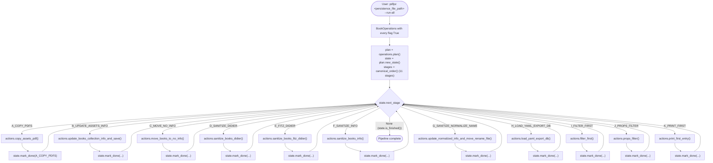
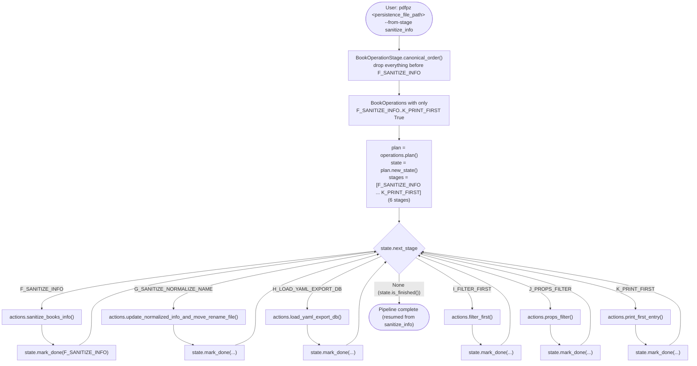
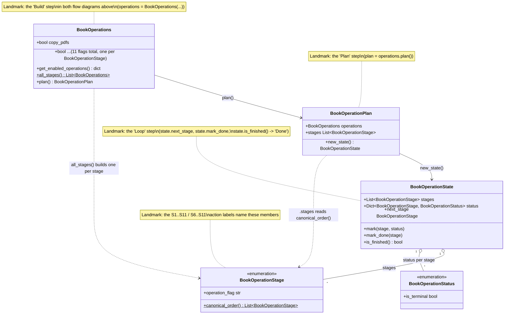

# API cli highlevel, classes and flows

## Current state

`cli.py`'s `main()` takes one `persistence_file_path` argument and a
`--flag` per pipeline stage. Whichever flags are `True` run, in
`operation_map`'s dict order, within a single invocation -- there is no
"run everything" or "resume from stage X" mode yet. Running the full
pipeline today means the user invoking `pdfpz` separately, once per
stage, as `cli.py`'s own trailing usage-example comments show.

`class_book_operations.py` already has the pieces for the design below,
just not wired into `cli.py` yet:

- **`BookOperationStage`** (`Enum`) -- the pipeline's 11 stages, in
  canonical order (`canonical_order()`), each mapped to a
  `BookOperations` flag name (`operation_flag`).
- **`BookOperations`** (`dataclass`) -- the same 11 flags `cli.py`
  already exposes as `--copy-pdfs`, `--sanitize-info`, etc.
- **`BookOperationPlan`** -- turns a `BookOperations`' enabled flags
  into the ordered subset of stages to run (`.stages`), and can build a
  `BookOperationState` scoped to just that subset (`.new_state()`).
- **`BookOperationState`** -- tracks each stage's `BookOperationStatus`
  (`PENDING`/`RUNNING`/`DONE`/`FAILED`/`SKIPPED`) and exposes
  `next_stage` -- the next non-terminal stage to run, or `None` once
  finished.

None of these run anything themselves -- calling the matching
`BooksActions` method for a stage is still `cli.py`'s job, same as
`operation_map` today.

## Future design

Add one new `cli.py` option, e.g. `--from-stage <flag-name>` (omitted
or `--from-stage copy_pdfs` == run everything), and a small runner loop
that walks `BookOperationState.next_stage` calling `operation_map`'s
matching function, exactly as `operation_map` already maps flag name to
`BooksActions` method today:

| Stage | Flag | `BooksActions` method |
|---|---|---|
| A_COPY_PDFS | `copy_pdfs` | `copy_assets_pdf` |
| B_UPDATE_ASSETS_INFO | `update_assets_info` | `update_books_collection_info_and_save` |
| C_MOVE_NO_INFO | `move_no_info` | `move_books_to_no_info` |
| D_SANITIZE_DIDIER | `sanitize_didier` | `sanitize_books_didier` |
| E_FITZ_DIDIER | `fitz_didier` | `sanitize_books_fitz_didier` |
| F_SANITIZE_INFO | `sanitize_info` | `sanitize_books_info` |
| G_SANITIZE_NORMALIZE_NAME | `sanitize_normalize_name` | `update_normalized_info_and_move_rename_file` |
| H_LOAD_YAML_EXPORT_DB | `load_yaml_export_db` | `load_yaml_export_db` |
| I_FILTER_FIRST | `filter_first` | `filter_first` |
| J_PROPS_FILTER | `props_filter` | `props_filter` |
| K_PRINT_FIRST | `print_first` | `print_first_entry` |

`BookOperations.all_stages()` (one single-flag `BookOperations` per
stage) is a separate extension point from the two flows below -- it
fits a design where each stage runs as its own isolated subprocess
call (`pdfpz <file> --copy-pdfs`, then `pdfpz <file>
--update-assets-info`, ...) rather than one in-process loop over a
single `BooksActions`. The two flows this doc covers use the
in-process `BookOperationPlan`/`BookOperationState` loop instead, since
that's the more direct fit for "one cli call runs several stages".

### Flow: user initiates processing from scratch

No `--from-stage` given (or `--from-stage copy_pdfs`) -- every stage
runs, in canonical order, starting at `A_COPY_PDFS`:

### Flow: user initiates processing from the sanitize-info step

`--from-stage sanitize_info` -- everything before `F_SANITIZE_INFO`
(`A_COPY_PDFS` .. `E_FITZ_DIDIER`) is skipped; the state only tracks
`F_SANITIZE_INFO` onward, e.g. because those earlier steps already ran
in a previous invocation:

### Class relationships (`class_book_operations.py`)

How the five classes above connect, with landmarks pointing back at the
`Build`/`Plan`/`Loop`/`Done` nodes and the `S1..S11`/`S6..S11` action
labels in the two flow diagrams:

`BookOperationStatus` isn't on either flow diagram yet -- `state.mark_done(...)` is shorthand for `mark(stage, BookOperationStatus.DONE)`; a real runner would also use `RUNNING`/`FAILED` around each `S<n>` call, which neither flow spells out today.

### What's still needed to wire this up (not yet implemented)

- A `--from-stage <flag-name>` cli.py option, validated against
  `BookOperationStage`'s known `operation_flag` values.
- Building the right `BookOperations` from it: every flag from the
  named stage onward `True` (via `BookOperationStage.canonical_order()`,
  slicing at the requested stage's index), rather than a single
  `--copy-pdfs`-style flag per stage as today.
- The runner loop itself in `load_books_collection_and_operate()`:
  replace the current one-pass `for operation_name, operation_func in
  operation_map.items(): if getattr(...): operation_func()` with a
  `while not state.is_finished()` loop over `state.next_stage`, marking
  `RUNNING`/`DONE`/`FAILED` around each `operation_map[stage.operation_flag]()`
  call so a failure partway through is visible per-stage rather than as
  one bare exception.
