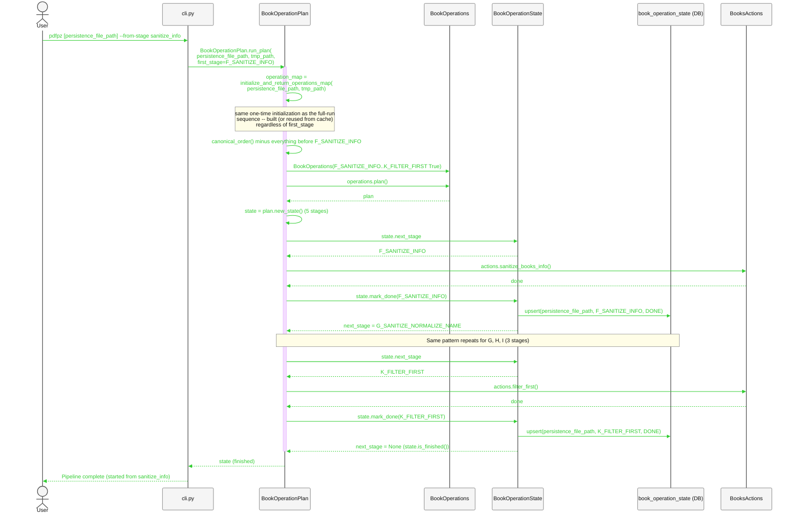
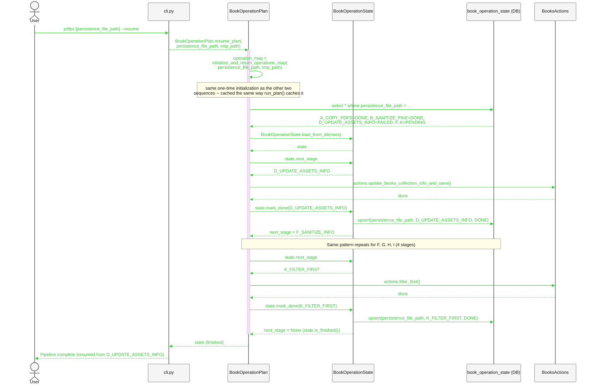
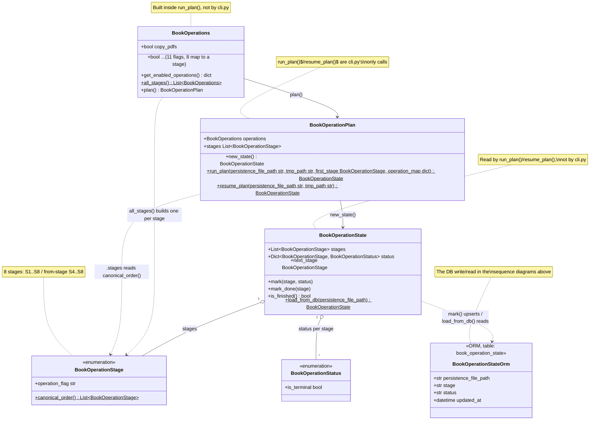

# API cli highlevel, classes and flows version 81.09

## Current state

`cli.py`'s `main()` takes one `persistence_file_path` and a `--flag`
per stage; whichever are `True` run in `operation_map`'s dict order,
one invocation per run. No "run everything" or "resume" mode yet --
today that means invoking `pdfpz` once per stage.

`class_book_operations.py` already has the pieces for the design below:

- **`BookOperationStage`** (`Enum`) -- the 8 pipeline stages, in
  canonical order (`canonical_order()`), each mapped to a
  `BookOperations` flag (`operation_flag`).
- **`BookOperations`** (`dataclass`) -- 11 flags total (matching
  `cli.py`'s 11 `--flag` options), but only 8 correspond to an actual
  stage -- `move_no_info`, `fitz_didier`, `print_first` are no longer
  wired into the pipeline; `canonical_order()` never yields them.
- **`BookOperationPlan`** -- turns enabled flags into the ordered
  subset of stages to run (`.stages`), and owns the whole run via
  `run_plan()`.
- **`BookOperationState`** -- tracks each stage's `BookOperationStatus`
  and exposes `next_stage`.

## Future design

`BookOperationPlan.run_plan(persistence_file_path, tmp_path, first_stage=None)`
is `cli.py`'s single entry point: builds `operation_map` itself via
`initialize_and_return_operations_map()` (caching it in
`_operations_map_cache` so a later call reuses it), builds
`BookOperations` (every stage, or only `first_stage` onward), plans it,
creates `state`, and runs the whole loop internally. `cli.py` calls it
once and never touches `operation_map`, `BookOperations`, a stage
value, or `state` directly.

| Stage | Flag | `BooksActions` method |
|---|---|---|
| A_COPY_PDFS | `copy_pdfs` | `copy_assets_pdf` |
| B_SANITIZE_PIKE | `sanitize_pike` | `sanitize_books_pike` |
| D_UPDATE_ASSETS_INFO | `update_assets_info` | `update_books_collection_info_and_save` |
| F_SANITIZE_INFO | `sanitize_info` | `sanitize_books_info` |
| G_SANITIZE_NORMALIZE_NAME | `sanitize_normalize_name` | `update_normalized_info_and_move_rename_file` |
| H_LOAD_YAML_EXPORT_DB | `export_books_to_db` | `export_books_to_db` |
| I_PROPS_FILTER | `props_filter` | `props_filter` |
| K_FILTER_FIRST | `filter_first` | `filter_first` |

Letters skip `C`/`E`/`J` (former `move_no_info`/`fitz_didier` stages,
dropped) and reuse `K` for the new final stage -- gaps are intentional,
not typos; see `class_book_operations.py`'s `# keep this comment` lines.

`BookOperations.all_stages()` (one `BookOperations` per stage) is a
separate extension point, for running each stage as its own subprocess
call instead of one in-process loop -- not what the sequences below use.

### Resumability: a DB entity for `BookOperationState`

One row per `(persistence_file_path, stage)`, so status survives a
crash mid-run:

| Column | Type | Notes |
|---|---|---|
| `persistence_file_path` | `String`, PK | the run's identifying path |
| `stage` | `String`, PK | a `BookOperationStage` member name |
| `status` | `String` | a `BookOperationStatus` member name |
| `updated_at` | `DateTime` | last change |

`BookOperationState.mark(stage, status)` upserts this table alongside
the in-memory dict. `load_from_db(persistence_file_path)` reconstructs
`state` from it instead of `new_state()`'s all-`PENDING` default --
that's what resume (below) uses to find where a run stopped.

### Sequence: triggering a full run (`cli.py` stays stage-agnostic)

`cli.py` calls `run_plan(persistence_file_path, tmp_path)` once;
`BookOperationPlan` builds `operation_map` itself (caching it), builds
`BookOperations`, plans, creates `state`, and runs the whole loop
between `Plan`/`State`/`Actions`. Each `mark_done` also upserts
`book_operation_state`. First (`A_COPY_PDFS`) and last (`K_FILTER_FIRST`)
stages shown in full; the rest collapse into a `Note`:

```mermaid
%%{init: {
  "theme": "base",
  "themeVariables": {
    "fontSize": "48px",
    "actorFontSize": "48px",
    "messageFontSize": "44px",
    "noteFontSize": "40px",
    "actorBkg": "#f5f5f5",
    "actorBorder": "#555555",
    "actorTextColor": "#111111",
    "signalColor": "#32CD32",
    "signalTextColor": "#32CD32",
    "labelTextColor": "#32CD32",
    "noteBkgColor": "#fffde7",
    "noteBorderColor": "#777777",
    "noteTextColor": "#111111"
  },
  "themeCSS": ".messageText,.signalText,.labelText{fill:#32CD32 !important;stroke:none !important;} .messageLine0,.messageLine1{stroke:#32CD32 !important;}"
}}%%
sequenceDiagram
    actor User
    participant CLI as cli.py
    participant Plan as BookOperationPlan
    participant Ops as BookOperations
    participant State as BookOperationState
    participant DB as book_operation_state (DB)
    participant Actions as BooksActions

    User->>CLI: pdfpz [persistence_file_path] --run-all
    CLI->>Plan: BookOperationPlan.run_plan(<br/>persistence_file_path, tmp_path)
    activate Plan
    Plan->>Plan: operation_map =<br/>initialize_and_return_operations_map(<br/>persistence_file_path, tmp_path)
    Note over Plan: one-time: builds BooksCollection + BooksActions,<br/>returns {flag_name: bound actions method};<br/>cached in _operations_map_cache
    Plan->>Ops: BookOperations(every flag True)
    Plan->>Ops: operations.plan()
    Ops-->>Plan: plan
    Plan->>Plan: state = plan.new_state()
    Plan->>State: state.next_stage
    State-->>Plan: A_COPY_PDFS
    Plan->>Actions: actions.copy_assets_pdf()
    Actions-->>Plan: done
    Plan->>State: state.mark_done(A_COPY_PDFS)
    State->>DB: upsert(persistence_file_path, A_COPY_PDFS, DONE)
    State-->>Plan: next_stage = B_SANITIZE_PIKE
    Note over Plan,DB: Same pattern repeats for B, D, F, G, H, I (6 stages)
    Plan->>State: state.next_stage
    State-->>Plan: K_FILTER_FIRST
    Plan->>Actions: actions.filter_first()
    Actions-->>Plan: done
    Plan->>State: state.mark_done(K_FILTER_FIRST)
    State->>DB: upsert(persistence_file_path, K_FILTER_FIRST, DONE)
    State-->>Plan: next_stage = None (state.is_finished())
    deactivate Plan
    Plan-->>CLI: state (finished)
    CLI-->>User: Pipeline complete
```

### Sequence: user explicitly starts from a stage (this is *not* a resume)

The user names a stage via `--from-stage`, regardless of any prior
run's outcome -- nothing here reads `book_operation_state`. Same shape
as above, with `first_stage` set; both building `operation_map` and
slicing `canonical_order()` at `F_SANITIZE_INFO` happen inside
`run_plan`, not `cli.py`:



### Sequence: resume after a failed run (`BookOperationPlan` finds where it stopped)

The user doesn't name a stage. Say `A_COPY_PDFS`/`B_SANITIZE_PIKE`
finished, `D_UPDATE_ASSETS_INFO` failed, and the process exited.
`resume_plan(persistence_file_path, tmp_path)` builds `operation_map`
itself (same as `run_plan`), reads `book_operation_state`, finds
`D_UPDATE_ASSETS_INFO` is the first non-`DONE` stage, and rebuilds
`state` via `load_from_db()` before continuing the same loop:



### Class relationships (`class_book_operations.py`)



`BookOperationStatus` (`RUNNING`/`FAILED` around each call) isn't
spelled out in the sequences above -- `mark_done` is shorthand for
`mark(stage, DONE)`.

### What's still needed (not yet implemented)

- `--from-stage <flag-name>` cli.py option -> `run_plan(operation_map,
  first_stage=<resolved stage>)`.
- `book_operation_state` table; `BookOperationState.mark()` upserting
  to it, `load_from_db(persistence_file_path)` reading it back.
- `BookOperationPlan.resume_plan(operation_map)`: reads
  `book_operation_state`, rebuilds `state` via `load_from_db()`, runs
  `run_plan()`'s loop. Falls back to a full run with no existing rows.
  This is the actual "resume" -- `--from-stage` is a manual override,
  not automatic resume.
- `load_books_collection_and_operate()` in `cli.py` still runs today's
  one-pass `for operation_name, operation_func in
  operation_map.items(): if getattr(...): operation_func()` instead of
  calling `run_plan(persistence_file_path, tmp_path)`.
  `operation_map`'s construction is already extracted into
  `initialize_and_return_operations_map()`, and `run_plan()` already
  calls it internally (caching the result in `_operations_map_cache`,
  per the sequences above) -- `cli.py` no longer needs to build
  `operation_map` itself at all. What's left is swapping that loop for
  a `run_plan()`/`resume_plan()` call.
