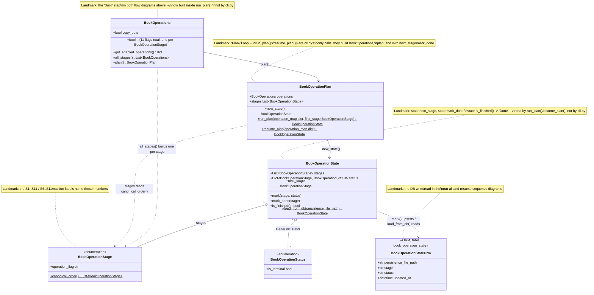

# API cli highlevel, classes and flows version 81.09

## Current state

`cli.py`'s `main()` takes one `persistence_file_path` argument and a
`--flag` per pipeline stage. Whichever flags are `True` run, in
`operation_map`'s dict order, within a single invocation -- there is no
"run everything" or "resume from stage X" mode yet. Running the full
pipeline today means the user invoking `pdfpz` separately, once per
stage, as `cli.py`'s own trailing usage-example comments show.

`class_book_operations.py` already has the pieces for the design below,
just not wired into `cli.py` yet:

- **`BookOperationStage`** (`Enum`) -- the pipeline's 11 stages, in
  canonical order (`canonical_order()`), each mapped to a
  `BookOperations` flag name (`operation_flag`).
- **`BookOperations`** (`dataclass`) -- the same 11 flags `cli.py`
  already exposes as `--copy-pdfs`, `--sanitize-info`, etc.
- **`BookOperationPlan`** -- turns a `BookOperations`' enabled flags
  into the ordered subset of stages to run (`.stages`), and can build a
  `BookOperationState` scoped to just that subset (`.new_state()`).
- **`BookOperationState`** -- tracks each stage's `BookOperationStatus`
  (`PENDING`/`RUNNING`/`DONE`/`FAILED`/`SKIPPED`) and exposes
  `next_stage` -- the next non-terminal stage to run, or `None` once
  finished.

None of these run anything themselves -- calling the matching
`BooksActions` method for a stage is still `cli.py`'s job, same as
`operation_map` today.

## Future design

Add one new `cli.py` option, e.g. `--from-stage <flag-name>` (omitted
== run everything), and give `BookOperationPlan` a single classmethod
entry point, `run_plan(operation_map, first_stage=None)`, that manages
every other entity itself: it builds the right `BookOperations` (every
flag `True` when `first_stage` is omitted, or only `first_stage`
onward via `BookOperationStage.canonical_order()` when given), calls
`.plan()`, creates the `BookOperationState`, and runs the entire
`state.next_stage` / call / `mark_done` loop internally before handing
the finished `state` back. `cli.py` calls `BookOperationPlan.run_plan(
operation_map, first_stage=...)` exactly once, with or without
`first_stage`, and never touches `BookOperations`, a
`BookOperationStage` value, or `state` itself -- only
`BookOperationPlan` (and the `BookOperationState`/`BookOperations` it
creates along the way) know any of that.

| Stage | Flag | `BooksActions` method |
|---|---|---|
| A_COPY_PDFS | `copy_pdfs` | `copy_assets_pdf` |
| B_UPDATE_ASSETS_INFO | `update_assets_info` | `update_books_collection_info_and_save` |
| C_MOVE_NO_INFO | `move_no_info` | `move_books_to_no_info` |
| D_SANITIZE_DIDIER | `sanitize_didier` | `sanitize_books_didier` |
| E_FITZ_DIDIER | `fitz_didier` | `sanitize_books_fitz_didier` |
| F_SANITIZE_INFO | `sanitize_info` | `sanitize_books_info` |
| G_SANITIZE_NORMALIZE_NAME | `sanitize_normalize_name` | `update_normalized_info_and_move_rename_file` |
| H_LOAD_YAML_EXPORT_DB | `load_yaml_export_db` | `load_yaml_export_db` |
| I_FILTER_FIRST | `filter_first` | `filter_first` |
| J_PROPS_FILTER | `props_filter` | `props_filter` |
| K_PRINT_FIRST | `print_first` | `print_first_entry` |

`BookOperations.all_stages()` (one single-flag `BookOperations` per
stage) is a separate extension point from the two flows below -- it
fits a design where each stage runs as its own isolated subprocess
call (`pdfpz <file> --copy-pdfs`, then `pdfpz <file>
--update-assets-info`, ...) rather than one in-process loop over a
single `BooksActions`. The two flows this doc covers use the
in-process `BookOperationPlan`/`BookOperationState` loop instead, since
that's the more direct fit for "one cli call runs several stages".

### Resumability: a DB entity for `BookOperationState`

In memory, `BookOperationState.status` disappears the moment the
process exits -- crash partway through and there's nothing to resume
*from*. A new table, one row per `(persistence_file_path, stage)`,
gives it somewhere to live between invocations:

| Column | Type | Notes |
|---|---|---|
| `persistence_file_path` | `String`, PK | identifies which run this row belongs to -- the same path `cli.py` already takes as its one positional argument |
| `stage` | `String`, PK | a `BookOperationStage` member name, e.g. `"C_MOVE_NO_INFO"` |
| `status` | `String` | a `BookOperationStatus` member name: `PENDING`/`RUNNING`/`DONE`/`FAILED`/`SKIPPED` |
| `updated_at` | `DateTime` | last time this stage's status changed |

`BookOperationState.mark(stage, status)` upserts this table on
`(persistence_file_path, stage)` in addition to updating its in-memory
dict, so a crash mid-run still leaves an accurate row per stage rather
than nothing. `BookOperationState.load_from_db(persistence_file_path)`
does the reverse -- reconstructs a `BookOperationState` from whatever
rows already exist for that path, instead of `new_state()`'s all-`PENDING`
default. That's what the resume sequence further down uses to find
where a previous run actually stopped.

### Sequence: triggering a full run (`cli.py` stays stage-agnostic)

The flowchart above shows *what* runs; this sequence diagram shows
*who calls whom, in what order* -- and, per the design above, `cli.py`
only ever calls `BookOperationPlan.run_plan(operation_map)` once, with
no `first_stage`. `BookOperationPlan` manages every other entity
itself: building `BookOperations`, calling `.plan()`, creating
`state`, and running the whole `next_stage` / call / `mark_done` loop
between `Plan`, `State`, and `Actions` -- `cli.py` is never shown a
`BookOperations` instance or a `BookOperationStage` value.
`state.mark_done(...)` also upserts `book_operation_state` (per the DB
entity above), which is what makes the resume sequence further down
possible. The diagram spells out full detail for the first stage
(`A_COPY_PDFS`) and, per the request to also detail the step right
before the flow finishes, the last stage (`K_PRINT_FIRST`) -- the
stages in between collapse into a `Note`, same as the flowchart's
repeated `Loop` arrow:

```mermaid
%%{init: {
  "theme": "base",
  "themeVariables": {
    "fontSize": "32px",
    "actorFontSize": "32px",
    "messageFontSize": "28px",
    "noteFontSize": "28px",
    "actorBkg": "#f5f5f5",
    "actorBorder": "#555555",
    "actorTextColor": "#111111",
    "signalColor": "#32CD32",
    "signalTextColor": "#32CD32",
    "labelTextColor": "#32CD32",
    "noteBkgColor": "#fffde7",
    "noteBorderColor": "#777777",
    "noteTextColor": "#111111"
  },
  "themeCSS": ".messageText,.signalText,.labelText{fill:#32CD32 !important;stroke:none !important;} .messageLine0,.messageLine1{stroke:#32CD32 !important;}"
}}%%
sequenceDiagram
    actor User
    participant CLI as cli.py
    participant Plan as BookOperationPlan
    participant State as BookOperationState
    participant DB as book_operation_state (DB)
    participant Actions as BooksActions

    User->>CLI: pdfpz &lt;persistence_file_path&gt; --resume
    CLI->>Plan: BookOperationPlan.resume_plan(operation_map)
    activate Plan
    Plan->>DB: select * where persistence_file_path = ...
    DB-->>Plan: A_COPY_PDFS=DONE, B_UPDATE_ASSETS_INFO=DONE,<br/>C_MOVE_NO_INFO=FAILED, D..K=PENDING
    Plan->>State: BookOperationState.load_from_db(rows)
    State-->>Plan: state
    Plan->>State: state.next_stage
    State-->>Plan: C_MOVE_NO_INFO
    Plan->>Actions: actions.move_books_to_no_info()
    Actions-->>Plan: done
    Plan->>State: state.mark_done(C_MOVE_NO_INFO)
    State->>DB: upsert(persistence_file_path, C_MOVE_NO_INFO, DONE)
    State-->>Plan: next_stage = D_SANITIZE_DIDIER
    Note over Plan,DB: Same next_stage / call / mark_done / DB-upsert pattern<br/>repeats internally for stages D..J (7 stages)
    Plan->>State: state.next_stage
    State-->>Plan: K_PRINT_FIRST
    Plan->>Actions: actions.print_first_entry()
    Actions-->>Plan: done
    Plan->>State: state.mark_done(K_PRINT_FIRST)
    State->>DB: upsert(persistence_file_path, K_PRINT_FIRST, DONE)
    State-->>Plan: next_stage = None (state.is_finished())
    deactivate Plan
    Plan-->>CLI: state (finished)
    CLI-->>User: Pipeline complete (resumed from C_MOVE_NO_INFO)
```


### Sequence: user explicitly starts from a stage (this is *not* a resume)

This is worth being precise about: nothing here looks at
`book_operation_state` or any prior run's outcome. The user is simply
telling `cli.py` "start at `F_SANITIZE_INFO`" via `--from-stage`,
regardless of whether anything ran before, succeeded, or failed --
it's a manually-specified starting point, same shape as the first
sequence diagram, now with `first_stage` set: `cli.py` calls
`BookOperationPlan.run_plan(operation_map,
first_stage=BookOperationStage.F_SANITIZE_INFO)` once. The flowchart's
`Resolve`/`Build` steps -- slicing `canonical_order()` at
`F_SANITIZE_INFO` and building a `BookOperations` with only that
subset `True` -- now happen inside `run_plan` itself, not in `cli.py`;
`cli.py` only supplies which stage to start at, as a value, never
performs the slicing or touches `BookOperations`/`state` directly. The
real, DB-driven resume -- where `BookOperationPlan` itself figures out
where a *previous* run stopped -- is the next sequence diagram below.
Full detail is shown for the first stage in this run
(`F_SANITIZE_INFO`) and the last (`K_PRINT_FIRST`); the
`G_SANITIZE_NORMALIZE_NAME`..`J_PROPS_FILTER` stages in between
collapse into a `Note`:

```mermaid
%%{init: {
  "theme": "base",
  "themeVariables": {
    "fontSize": "32px",
    "actorFontSize": "32px",
    "messageFontSize": "28px",
    "noteFontSize": "28px",
    "actorBkg": "#f5f5f5",
    "actorBorder": "#555555",
    "actorTextColor": "#111111",
    "signalColor": "#32CD32",
    "signalTextColor": "#32CD32",
    "labelTextColor": "#32CD32",
    "noteBkgColor": "#fffde7",
    "noteBorderColor": "#777777",
    "noteTextColor": "#111111"
  },
  "themeCSS": ".messageText,.signalText,.labelText{fill:#32CD32 !important;stroke:none !important;} .messageLine0,.messageLine1{stroke:#32CD32 !important;}"
}}%%
sequenceDiagram
    actor User
    participant CLI as cli.py
    participant Plan as BookOperationPlan
    participant Ops as BookOperations
    participant State as BookOperationState
    participant DB as book_operation_state (DB)
    participant Actions as BooksActions

    User->>CLI: pdfpz &lt;persistence_file_path&gt; --from-stage sanitize_info
    CLI->>Plan: BookOperationPlan.run_plan(operation_map,<br/>first_stage=F_SANITIZE_INFO)
    activate Plan
    Plan->>Plan: BookOperationStage.canonical_order()<br/>drop everything before F_SANITIZE_INFO
    Plan->>Ops: BookOperations(F_SANITIZE_INFO..K_PRINT_FIRST True)
    Plan->>Ops: operations.plan()
    Ops-->>Plan: plan
    Plan->>Plan: state = plan.new_state()<br/>stages = [F_SANITIZE_INFO ... K_PRINT_FIRST] (6 stages)
    Plan->>State: state.next_stage
    State-->>Plan: F_SANITIZE_INFO
    Plan->>Actions: actions.sanitize_books_info()
    Actions-->>Plan: done
    Plan->>State: state.mark_done(F_SANITIZE_INFO)
    State->>DB: upsert(persistence_file_path, F_SANITIZE_INFO, DONE)
    State-->>Plan: next_stage = G_SANITIZE_NORMALIZE_NAME
    Note over Plan,DB: Same next_stage / call / mark_done / DB-upsert pattern<br/>repeats internally for stages G..J (4 stages)
    Plan->>State: state.next_stage
    State-->>Plan: K_PRINT_FIRST
    Plan->>Actions: actions.print_first_entry()
    Actions-->>Plan: done
    Plan->>State: state.mark_done(K_PRINT_FIRST)
    State->>DB: upsert(persistence_file_path, K_PRINT_FIRST, DONE)
    State-->>Plan: next_stage = None (state.is_finished())
    deactivate Plan
    Plan-->>CLI: state (finished)
    CLI-->>User: Pipeline complete (started from sanitize_info)
```

### Sequence: resume after a failed run (`BookOperationPlan` finds where it stopped)

This is the actual resume: the user doesn't name a stage at all. Say a
previous `--run-all` got through `A_COPY_PDFS` and
`B_UPDATE_ASSETS_INFO`, then `C_MOVE_NO_INFO` failed -- `state.mark(...,
FAILED)` upserted that into `book_operation_state`, and the process
exited. `cli.py` calls a new `BookOperationPlan.resume_plan(operation_map)`,
with no `first_stage` -- `resume_plan` reads `book_operation_state` for
this `persistence_file_path` itself, finds `C_MOVE_NO_INFO` is the
first stage that isn't `DONE`, and reconstructs `state` from those rows
via `BookOperationState.load_from_db()` (so `A_COPY_PDFS`/
`B_UPDATE_ASSETS_INFO` are already marked done and `next_stage` resolves
straight to `C_MOVE_NO_INFO`) before continuing the same
next_stage/call/mark_done/DB-upsert loop `run_plan` uses. If no rows
exist yet for this path (first run ever), `resume_plan` behaves exactly
like `run_plan()` with no `first_stage`:

```mermaid
%%{init: {
  "theme": "default",
  "themeVariables": {
      "fontSize": "32px",
      "actorFontSize": "32px",
      "messageFontSize": "28px",
      "noteFontSize": "28px",
      "messageMargin: 50",
      "actorBkg": "#f5f5f5",
      "actorBorder": "#555555",
      "actorTextColor": "#111111",
      "signalColor": "#90EE90",
      "signalTextColor": "#90EE90",
      "noteBkgColor": "#fffde7",
      "noteBorderColor": "#777777",
      "noteTextColor": "#111111"
    },
    "themeCSS": ".messageLine0,.messageLine1{stroke:#90EE90 !important;} .messageText{fill:#90EE90 !important; color:#90EE90 !important; font-size:30px !important;} .signalText{fill:#90EE90 !important;} .labelText{fill:#90EE90 !important;}"
}}%%
sequenceDiagram
    actor User
    participant CLI as cli.py
    participant Plan as BookOperationPlan
    participant State as BookOperationState
    participant DB as book_operation_state (DB)
    participant Actions as BooksActions

    User->>CLI: pdfpz &lt;persistence_file_path&gt; --resume
    CLI->>Plan: BookOperationPlan.resume_plan(operation_map)
    activate Plan
    Plan->>DB: select * where persistence_file_path = ...
    DB-->>Plan: A_COPY_PDFS=DONE, B_UPDATE_ASSETS_INFO=DONE,<br/>C_MOVE_NO_INFO=FAILED, D..K=PENDING
    Plan->>State: BookOperationState.load_from_db(rows)
    State-->>Plan: state
    Plan->>State: state.next_stage
    State-->>Plan: C_MOVE_NO_INFO
    Plan->>Actions: actions.move_books_to_no_info()
    Actions-->>Plan: done
    Plan->>State: state.mark_done(C_MOVE_NO_INFO)
    State->>DB: upsert(persistence_file_path, C_MOVE_NO_INFO, DONE)
    State-->>Plan: next_stage = D_SANITIZE_DIDIER
    Note over Plan,DB: Same next_stage / call / mark_done / DB-upsert pattern<br/>repeats internally for stages D..J (7 stages)
    Plan->>State: state.next_stage
    State-->>Plan: K_PRINT_FIRST
    Plan->>Actions: actions.print_first_entry()
    Actions-->>Plan: done
    Plan->>State: state.mark_done(K_PRINT_FIRST)
    State->>DB: upsert(persistence_file_path, K_PRINT_FIRST, DONE)
    State-->>Plan: next_stage = None (state.is_finished())
    deactivate Plan
    Plan-->>CLI: state (finished)
    CLI-->>User: Pipeline complete (resumed from C_MOVE_NO_INFO)
```

### Class relationships (`class_book_operations.py`)

How the six classes above connect, with landmarks pointing back at the
`Build`/`Plan`/`Loop`/`Done` nodes and the `S1..S11`/`S6..S11` action
labels in the two flow diagrams:



`BookOperationStatus` isn't on either flow diagram yet -- `state.mark_done(...)` is shorthand for `mark(stage, BookOperationStatus.DONE)`; a real runner would also use `RUNNING`/`FAILED` around each `S<n>` call, which neither flow spells out today.

### What's still needed to wire this up (not yet implemented)

- A `--from-stage <flag-name>` cli.py option, validated against
  `BookOperationStage`'s known `operation_flag` values, passed straight
  through as `run_plan(operation_map, first_stage=<resolved stage>)` --
  `cli.py` resolves the flag name to a `BookOperationStage` value, but
  does none of the slicing itself.
- `BookOperationPlan.run_plan(operation_map, first_stage=None)` itself,
  as a classmethod: build `BookOperations` (every flag `True`, or only
  `first_stage` onward via `BookOperationStage.canonical_order()`
  sliced at `first_stage`'s index), call `.plan()`, create `state`,
  then a `while not state.is_finished()` loop over `state.next_stage`,
  marking `RUNNING`/`DONE`/`FAILED` around each
  `operation_map[stage.operation_flag]()` call so a failure partway
  through is visible per-stage rather than as one bare exception, and
  finally return the finished `state`.
  `load_books_collection_and_operate()` in `cli.py` shrinks to building
  `operation_map` and calling
  `BookOperationPlan.run_plan(operation_map, first_stage=...)` once --
  it no longer builds `BookOperations`, slices stages, or contains the
  loop itself, replacing the current one-pass `for operation_name,
  operation_func in operation_map.items(): if getattr(...):
  operation_func()`.
- The `book_operation_state` table itself (see the DB entity section
  above), plus `BookOperationState.mark()` upserting to it and
  `BookOperationState.load_from_db(persistence_file_path)` reading it
  back.
- `BookOperationPlan.resume_plan(operation_map)`: reads
  `book_operation_state` for the given `persistence_file_path`,
  reconstructs `state` via `load_from_db()`, then runs the same loop
  `run_plan()` does. Falls back to a full run when no rows exist yet
  for that path. This is the actual "pick up where a previous run
  failed" behavior -- `--from-stage` (above) is a manual override, not
  automatic resume, and shouldn't be confused with it.
